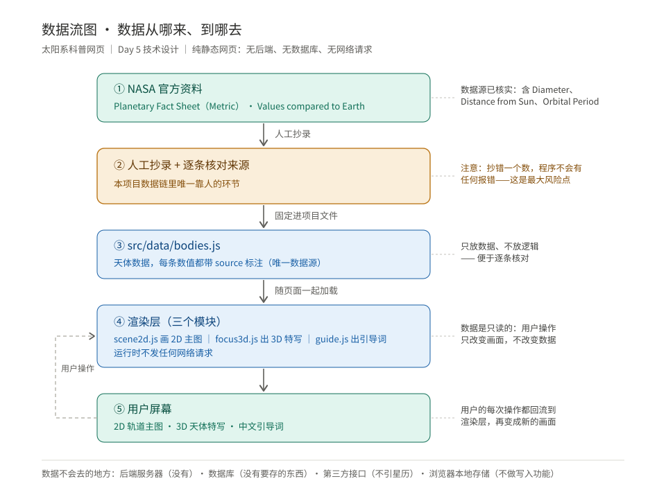
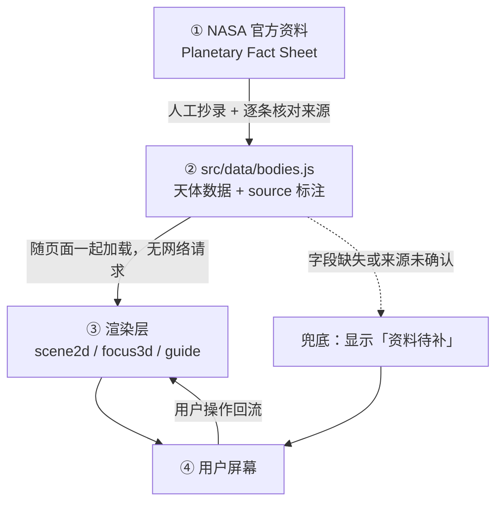

# 太阳系科普网页 · 技术设计文档（TECH_DESIGN.md）

> **项目**：可交互的 2D/3D 太阳系科普网页
> **阶段**：Vibe Coding 五步工作流 · 第 3 步「技术设计」
> **日期**：2026-09-20（Day 5）
> **上游依据**：`PRD.md` v1.1（产品需求）、`research.md`（同类产品实证研究）
> **范围方案**：B —— 2D 轨道主图 + 点天体弹出 3D 聚焦
> **使用者的技术背景**：**零基础**，本项目同时是学习项目

### 修订记录

| 版本 | 日期 | 改动 |
|---|---|---|
| v1.0 | 2026-09-20 | 初稿：技术路线、项目结构、数据对象、内部模块接口、错误处理、可配置项、部署与回滚、迭代节奏。**「数据流」一节留空，由板块③ 补齐** |
| **v1.1** | **2026-09-22** | 关闭未决 #1（**哈雷彗星数据来源**确认为 NASA/JPL SBDB 官方 API）。**第 3.1 节 `SolarBody` 新增 `eccentricity` 字段**（Day 7 实现椭圆轨道所需，数据取自 NASA fact sheet 的 `Orbital Eccentricity` 行）。文档结构未变 |
| **v1.2** | **2026-09-23** | **第 7 节「可配置项」由示意值改为实测值**，并补入 `SCALE_MODE_OPTIONS`。其中 `DEFAULT_TIME_SCALE` 由「实时」改为**「演示」**——实测「实时」档违反 PRD 验收 V1（原因见第 7 节说明）。另在此记录 Three.js 版本号（第 1.4 节风险 2 要求） |

---

## 0. 一句话技术路线

> **一个不需要服务器、不需要构建步骤的静态网页：单页 HTML 承载界面，行星数据写死在项目里，2D 主图用 SVG 画，3D 聚焦在点开时才加载。**

---

## 1. 技术路线

### 1.1 路线全貌

| 环节 | 选型 | 说明 |
|---|---|---|
| 交付形态 | **纯静态网页** | 无后端、无数据库（理由见第 1.2 节） |
| 构建方式 | **无构建** | 不引入打包工具，写完直接打开就能跑 |
| 界面骨架 | **单个 `index.html`** | 一个入口文件，其余按模块拆成独立 `.js` |
| 2D 主图 | **SVG** | 每个天体是一个可点击的图形元素 |
| 3D 聚焦 | **Three.js（本地文件，按需加载）** | 只在点开天体时才加载，保证首屏速度 |
| 数据 | **JS 文件写死** | 行星资料是固定内容，不需要请求接口 |
| 样式 | **原生 CSS** | 不引预处理器 |
| 代码托管 | **GitHub** | 沿用现有仓库 |
| 部署 | **静态托管**（优先用已连接的 EdgeOne Makers，GitHub Pages 为备选） | 具体在 Day 7 执行 |

### 1.2 为什么是这条路线

**理由 1：本项目根本没有"后端"要解决的问题。**
数据是行星资料——公开、人人相同、永不改变。按板块① 讲过的判断标准（「有没有必须存在服务器上、且因人而异的数据？」），答案是"没有"。既然没有要服务器做的事，加后端就是**凭空增加一层会坏的东西**。

**理由 2：学习成本必须压到最低——这是学习项目，不是交付项目。**
工具链越少，你能看懂、能改动的部分就越多。引入打包工具后，你会面对一堆跟太阳系毫无关系的报错（依赖、版本、路径），而**Vibe Coding 最容易卡死的地方恰恰是"装依赖/打包"这一环**。砍掉它，排错难度直接降一档。

**理由 3：无构建 = 无构建报错。**
没有 `npm install`、没有编译步骤，就不会出现"代码没问题但跑不起来"这种最难查的情况。文件存盘，刷新浏览器，就看到结果。

**理由 4：手机端适配更容易达成。**
你明确要求手机端可用（PRD V8）。不引框架、不加构建，页面体积和运行开销都最小——这恰好是手机端最在意的两件事。

**理由 5：部署不需要任何额外账号。**
代码托管沿用 GitHub；部署走静态托管，不需要服务器、不需要数据库账号。用户限制里写明"账号以 GitHub 为主"，这条路线完全吻合。

**理由 6：静态页是"永不腐烂"的形态。**
没有服务端进程要维护、没有数据库要升级、没有依赖会在半年后失效。对一个人维护的科普页，这是最长的保质期。

### 1.3 为什么不选别的（关键取舍）

| 考虑过的做法 | 为什么不选 |
|---|---|
| **React / Vue + 打包工具** | 对一个只有两三个视图的静态科普页是**过度设计**。它解决的是"大型应用状态复杂"的问题，而我们没有这个问题，却要付出学习成本和构建报错风险 |
| **2D 主图用 Canvas 绘制** | Canvas 是一整块画布，**点了哪儿要自己算命中检测**，还要自己写重绘逻辑。而我们的天体一共只有十来个，用 SVG 时**每个天体就是一个独立元素，点击天然可用**，改动也更直观（改一行标签就能改一个行星） |
| **3D 用 CSS 3D 做"伪球"** | CSS 3D 做不出正确的球面贴图畸变，看起来会像"卷起来的纸"。而 PRD 验收标准 V3 明确要求"有立体感、能自由旋转"，CSS 3D 有交付风险 |
| **数据用 `.json` + `fetch` 读取** | 本地直接双击打开 `.html` 时，浏览器会因安全策略拦截对本地 `.json` 的读取（CORS）。**用 `.js` 文件把数据挂成变量，就没有这个问题**——这是本项目一个非常具体的坑 |
| **Three.js 从 CDN 引入** | 依赖外部网络，一旦 CDN 慢或不可达，页面就会**白屏**——而 PRD 5.3 的硬底线正是"不出现白屏"。**把库文件放本地，代价是一个文件，换来的是确定性** |
| **一次性把 3D 场景全建好** | 会拖慢首屏，可能违反 V1「3 秒内看到画面」。所以 3D 库**不在首屏同步加载**，具体加载时机见下方说明 |

> **3D 库的加载时机（Day 7 第 5 步实测修正）**
>
> 本文档初稿写的是「**按需加载**：点开天体时才加载 3D」。实测发现纯按需有两个问题不能两全：
>
> - 首屏就同步加载 → 600 KB 的库拖慢开屏，威胁 **V1**（3 秒内看到画面）
> - 纯等点击才加载 → 首次点击到 3D 出现实测 **1031 ms**（读文件 + 解析 + 编译着色器），**超过 V3 的「1 秒内」**
>
> 最终采用**空闲预取**：
>
> 1. 首屏同步加载的只有 `index.html` + 数据 + 2D 主图，保证 **V1**
> 2. 首屏画完之后（`load` 事件之后），用 `requestIdleCallback` 趁浏览器空闲把 Three.js 取回来
> 3. 用户点开天体时，库已在内存里，只剩建场景与渲染
>
> 这样 V1 与 V3 两条验收都能满足。预取失败时**不提示**（用户还没点，弹提示只会莫名），
> 等用户真点到天体时再走正常失败路径给出提示。

### 1.4 代价与已知风险（诚实记录）

| # | 代价 / 风险 | 说明与对策 |
|---|---|---|
| 1 | 代码会**偏"手写"**，不如框架规整 | 代价可接受：文件少、规模小，且正是学习项目想要的“看得懂” |
| 2 | 需要**手工管理 Three.js 版本** | 对策：库文件放 `vendor/` 并在此文档记录版本号，升级时看同目录说明 |
| 3 | 手机端 3D 性能未知 | 属**未决问题**：若低端机上 3D 明显卡顿，按 PRD 3.4 降级红线处理（F2 可降级） |
| 4 | 天体外观素材的来源与**版权** | PRD 本期不做"大型真实纹理贴图包"，因此外观以**程序化配色 + 简化形状**为主，并在页面注明"外观为示意"。若使用任何外部图像，必须记录来源与许可 |

---

## 2. 项目结构

```
Sirius_VibeCoding_Lib/
├── AGENTS.md                 项目规则（Day 1）
├── research.md               需求研究（Day 3）
├── PRD.md                    产品需求文档（Day 4）
├── TECH_DESIGN.md            本文档（Day 5）
├── index.html                ← 唯一入口页面
├── .gitignore
│
├── src/
│   ├── data/
│   │   └── bodies.js         全部天体数据 + 来源标注（唯一数据源）
│   ├── scene2d.js            2D 主图：画轨道与天体、处理点击与缩放平移
│   ├── focus3d.js            3D 聚焦：按需加载 Three.js，渲染天体特写
│   ├── controls.js           调控区：时间流速 / 尺度切换 / 教学对比
│   ├── guide.js              引导主线：12 站的推进与文案
│   └── fallback.js           错误兜底：加载失败与不支持环境时的提示
│
├── styles/
│   └── main.css              全部样式
│
├── vendor/
│   └── three.min.js          3D 库（本地文件，版本号见同目录说明）
│
└── assets/
    └── flow-data.svg         ← 数据流图（板块③ 产出）
```

---

## 3. 数据对象及字段

> 本项目**没有数据库**。这里定义的"数据对象"是指**项目里的数据结构**。
> 全部数据集中在 `src/data/bodies.js`，是唯一数据源。

### 3.1 天体对象（`SolarBody`）

| 字段 | 类型 | 含义 | 来源 / 说明 |
|---|---|---|---|
| `id` | 字符串 | 唯一标识，如 `earth` | 自定，全小写 |
| `nameZh` | 字符串 | 中文名，如 `地球` | 自定 |
| `nameEn` | 字符串 | 英文名，如 `Earth` | 与 NASA 来源同名，便于核对 |
| `type` | 枚举 | `star` / `planet` / `moon` / `comet` / `region` | 与 PRD 3.1 覆盖范围对应 |
| `diameterKm` | 数值 | 直径（km） | **NASA Planetary Fact Sheet → `Diameter (km)`** |
| `distanceFromSunKm` | 数值 | 距日平均距离（km） | **NASA → `Distance from Sun (10^6 km)`，存 km 需换算** |
| `orbitalPeriodDays` | 数值 | 公转周期（天） | **NASA → `Orbital Period (days)`** |
| `compareToEarth` | 对象 | 与地球对比：`{ diameter, distance, period }` | **NASA → `planet_table_ratio.html`（Values compared to Earth）** |
| `appearance` | 对象 | 外观：`{ mainColor, hasRing, brightness }` | 需与实际相符，不得随意上色（PRD 5.2-6） |
| `source` | 字符串 | 该天体数据的来源标注 | **每条必填**，对应 PRD 5.1 |
| `sourceStatus` | 枚举 | `verified` / `pending` | `pending` 表示来源尚未确认 |

### 3.2 引导站对象（`GuideStation`）

| 字段 | 类型 | 含义 |
|---|---|---|
| `index` | 数值 | 站序，1–12（顺序见 PRD 3.3） |
| `bodyId` | 字符串 | 对应 `SolarBody.id`；小行星带对应 `region` 类型 |
| `titleZh` | 字符串 | 该站标题 |
| `guideText` | 字符串 | 该站的中文引导语 |
| `keyPoints` | 字符串数组 | 该站要讲清的 1–3 个要点 |

### 3.3 数据规则（硬约束）

| # | 规则 |
|---|---|
| 1 | 任何数值字段都必须有对应 `source`，**没有来源的数值不准进这个文件** |
| 2 | 哈雷彗星的来源未确认前，`sourceStatus` 一律为 `pending`，**不得填写未经核实的具体数值** |
| 3 | 从 `10^6 km` 换算到 `km` 时，换算结果需与原始值一起标注，便于反查 |
| 4 | 数据文件里**只放数据，不放逻辑**——便于逐条核对（对应板块① 讲的"人工抄录核对"环节） |

---

## 4. 内部模块接口（替代模板里的「API 列表」）

> **说明**：本项目是纯前端静态页，**没有对外 API**，也不调用任何外部数据接口（PRD 第 7 节：不引入星历）。
> 模板要求的「API 列表」在这里对应的真实内容是——**前端模块之间的接口契约**。

| 模块 | 文件 | 暴露的接口 | 作用 |
|---|---|---|---|
| 数据模块 | `src/data/bodies.js` | 全局变量 `SOLAR_BODIES`（天体数组）、`GUIDE_STATIONS`（引导站数组） | 提供全部数据，只读 |
| 2D 主图 | `src/scene2d.js` | `render2d(bodies, options)`、`onBodyClick(callback)`、`setScaleMode(mode)`、`setTimeScale(rate)` | 画主图、抛点击事件、响应调控 |
| 3D 聚焦 | `src/focus3d.js` | `openFocus(bodyId)`、`closeFocus()` | 按需加载 Three.js、渲染特写 |
| 调控区 | `src/controls.js` | `initControls({ onTimeScale, onScaleMode, onCompare })` | 采集用户操作并回调 |
| 引导主线 | `src/guide.js` | `startGuide()`、`nextStation()`、`gotoStation(index)`、`onStationChange(callback)` | 推进 12 站 |
| 兜底 | `src/fallback.js` | `showFallback(reason)` | 出错时给用户可读提示 |

**接口约定**：模块之间**只通过上面这些方法名交互**，不直接读写对方的内部变量。这样任何一个模块出问题，都能单独替换。

---

## 5. 数据流

> **一句话说清**：数据从 NASA 官方资料出发，由人工抄录并逐条核对后固定进项目文件，**随页面一起抵达浏览器**，最终变成屏幕上的图——**全程不经过任何服务器**。

### 5.1 数据流图



> 图另存为独立文件 **`assets/flow-data.svg`**，可单独打开查看。

### 5.2 数据从哪来

| 环节 | 说明 |
|---|---|
| **源头** | NASA Planetary Fact Sheet（Metric）＋ Values compared to Earth 版（具体链接见 PRD 5.1） |
| **获取方式** | **人工抄录**——不是程序抓取，也不是接口请求 |
| **核对方式** | 每抄一条数值，就在数据文件里写上 `source`；抄完对着原始页面**逐条复查** |
| **未确认的数据** | 哈雷彗星来源尚未确认 → 标 `sourceStatus: pending`，**不填未经核实的具体数值** |

### 5.3 数据到哪去

| 环节 | 说明 |
|---|---|
| **存放在哪** | `src/data/bodies.js` —— 唯一数据源，**只放数据不放逻辑** |
| **怎么到达** | 随页面文件**一起发给浏览器**；页面运行时**不发任何网络请求** |
| **被谁使用** | `scene2d.js`（2D 主图）、`focus3d.js`（3D 特写）、`guide.js`（引导词） |
| **最终形态** | 屏幕上的轨道图、天体特写、引导文字 |

### 5.4 数据不会去的地方（同样重要）

| 不去 | 为什么 |
|---|---|
| 后端服务器 | 本项目**没有后端**（PRD 第 7 节） |
| 数据库 | **没有要长期存的东西**（无账号、无用户数据） |
| 任何第三方接口 | PRD 第 7 节：**不引入星历 / 实时数据** |
| 浏览器本地存储 | **不做写入功能**（PRD 8.1 已砍） |

### 5.5 这条链上唯一的风险点

**②「人工抄录 + 核对」是整条数据链里唯一"靠人"的环节，也是唯一不会自动报错的环节。**

- 程序抓取出错 → 通常会报错，或得到一眼可辨的异常值
- **人手抄错一个数 → 页面照常显示，没有任何提示**

**这是本项目数据质量的真正命门。** 对策已写死在数据规则里（第 3.3 节）：每条数值必须有 `source`；来源未确认的一律标 `pending`，不允许悄悄展示。

### 5.6 用户操作的回流

用户的操作**不改变数据**，只改变渲染层的状态：

```
用户操作 → controls.js → scene2d.js / focus3d.js → 画面变化
```

**数据是只读的**——本项目没有任何例外。

### 5.7 mermaid 源码（便于将来编辑）



---

## 6. 错误处理

| # | 出错场景 | 用户会看到什么 | 处理方式 |
|---|---|---|---|
| 1 | 3D 库加载失败（文件缺失 / 网络异常） | 弹出可读提示，**2D 主图仍可用** | 捕获加载失败 → 调 `showFallback()` → 隐藏 3D 入口，不整页崩 |
| 2 | 某个天体数据字段缺失 | 资料卡该行显示"资料待补"，**不显示空白或 `undefined`** | 渲染前校验字段，缺失即降级显示 |
| 3 | 某天体 `sourceStatus` 为 `pending` | 资料卡明确标注"来源待确认" | 不允许悄悄展示未核实数据 |
| 4 | 浏览器不支持所需渲染能力 | 显示提示页，说明需要更换浏览器 | PRD 5.3 已给兼容底线 |
| 5 | 主图渲染异常 | 显示提示，不让页面变成纯白 | 顶层 `try/catch` + 兜底提示 |

**总原则**：**任何一块坏掉，都不能让整个页面白屏。** 宁可少给一个功能，不可整页打不开。

---

## 7. 可配置项（替代模板里的「环境变量」）

> **说明**：纯静态网页**没有环境变量**——环境变量是"同一份代码在不同服务器上跑出不同行为"的机制，我们没有服务器，所以不存在这个东西。
> 模板要求的「环境变量」在这里对应的真实内容是——**页面里可调的常量**，集中放在 `src/data/bodies.js` 顶部的一个 `CONFIG` 对象里。

| 配置项 | 作用 | 当前取值（Day 7 实测更新） |
|---|---|---|
| `TIME_SCALE_OPTIONS` | 时间流速的可选档位 | 暂停(0) / 实时(1) / **演示(100)** / 快进(1000)，单位「天/秒」 |
| `DEFAULT_TIME_SCALE` | 打开时的默认流速 | **演示（1 秒 = 100 天）** ⚠️ 见下方说明 |
| `SCALE_MODE_DEFAULT` | 默认尺度模式 | `illustrative`（图示比例） |
| `SCALE_MODE_OPTIONS` | 尺度模式的可选项 | 图示比例 / 真实比例 |
| `GUIDE_ENABLED` | 引导词是否默认开启 | 开启（引导主线尚未实现，该配置项待那一步加入） |
| `ENABLE_3D` | 3D 聚焦总开关（出问题时可一键关掉，页面退化为纯 2D） | 开启 |

> ⚠️ **`DEFAULT_TIME_SCALE` 为什么不是「实时」**（Day 7 第 4 步实测修正）
>
> 本文档初稿把默认流速的示意值写作「实时」，实现时发现**必须改**：
> 「实时」= 1 秒走 1 天，而水星绕太阳一圈要 88 秒 —— **肉眼看不出在动**，
> 会直接违反 PRD 验收 **V1**「打开页面后 3 秒内看到太阳系整体图，且行星肉眼可见在动」。
>
> 所以默认值定为**「演示」档（1 秒 = 100 天）**。「实时」档仍然保留，用户想对比真实速度时可以自己点。
>
> 实测佐证（第 4 步验收）：暂停档 1.5 秒位移 0.00；演示档 2 秒位移 6.9；快进档 2 秒位移 88.4（12.8 倍）。

**`ENABLE_3D` 这条是刻意的**：它让"3D 出问题"变成一个**可以一键规避的风险**，而不是一个必须连夜修好的故障。

---

## 8. 部署注意事项

| # | 注意事项 |
|---|---|
| 1 | 本项目是**静态资源**，部署只要"能放文件、能通过网址访问"即可，**不需要服务器进程、不需要数据库** |
| 2 | 部署前必须确认：`index.html` 里引用的所有路径都是**相对路径**，不能出现本机绝对路径（如 `D:\...`），否则部署后必然打不开 |
| 3 | `vendor/three.min.js` 必须随项目一起部署（这是"放本地"换来的确定性，不能忘） |
| 4 | 部署平台：优先使用**已连接的 EdgeOne Makers**（无需额外账号）；备选 GitHub Pages |
| 5 | 部署后必须**用手机实际打开一次**（PRD V8 要求），不能只看电脑上正常 |
| 6 | 部署属 **Day 7** 范围，今天不执行 |

---

## 9. 版本升级与回滚注意事项（替代模板里的「迁移」）

> **说明**：模板里的「迁移」是指数据库结构变更时搬数据。**本项目没有数据库，所以没有数据迁移这回事。**
> 对应的真实风险是另一种：**升级了代码或库之后，怎么安全退回去。**

| # | 事项 |
|---|---|
| 1 | 回滚一律用 `git revert`，**禁止** `git reset --hard` 与强制推送（AGENTS.md 七.1） |
| 2 | 回滚前先确认恢复到哪个提交，回滚后列出当前状态供核对（AGENTS.md 七.2） |
| 3 | 升级 Three.js 时：先记录当前版本号 → 换文件 → **手机与电脑各验一次**，通过才提交 |
| 4 | 数据文件（`bodies.js`）与代码分开提交，便于单独回滚"改错的数值"而不影响代码 |
| 5 | 本项目**没有"数据版本"概念**——页面用的永远是仓库里当前那份数据，天然一致 |

---

## 10. 迭代节奏（按"验收带宽"切块）

> **背景**：用户每天能投入到**核对与验收**的时间约 40–60 分钟（不是编码时间的限制，是"人盯着看"的时间）。
> 因此不是"做多少功能"要压缩，而是**每步抛给用户的东西必须切小到能在这段时间内核完**。

| 块 | 内容 | 验收方式 |
|---|---|---|
| 块 1 | `index.html` 骨架 + 数据文件（先放太阳和地球两颗，验证格式） | 打开能看到两颗天体在动 |
| 块 2 | 补齐全部 11 个可 3D 聚焦天体 + 轨道 | 对着 NASA 来源抽查数据 |
| 块 3 | 2D 主图的缩放与平移 | 亲手拖一拖、滚一滚 |
| 块 4 | 调控区：时间流速 | 肉眼看到快慢变化 |
| 块 5 | 调控区：尺度切换 + 教学对比 | 看到内外行星快慢差异 |
| 块 6 | 3D 聚焦（先做地球一颗） | 点开、转动、看是否立体 |
| 块 7 | 3D 聚焦补齐 | 逐个点开 |
| 块 8 | 引导主线 12 站 | 从第 1 站走到第 12 站 |
| 块 9 | 手机端适配与兜底 | 手机实测 |

**规则**：**一块做完就停下给用户核对，不连着往下做。**

---

## 11. 未决问题

| # | 问题 | 何时解决 |
|---|---|---|
| ~~1~~ | **~~哈雷彗星的数据来源~~**（~~不在 NASA Planetary Fact Sheet 覆盖范围内~~）<br>✅ **已于 Day 7 解决**：改用 **NASA/JPL 小天体数据库（SBDB）官方 API**，实测取值见 `PRD.md` 5.1（等效直径 11.0 km、半长轴 17.9 au、公转周期 27,700 d、偏心率 0.968） | 已解决 |
| 2 | 低端手机上的 3D 性能 | Day 6–7 实测 |
| 3 | 天体外观的具体配色方案（程序化生成到什么程度） | Day 6 |
| 4 | 椭圆轨道的实现精度 | Day 6 |
| 5 | 部署平台最终选择（EdgeOne Makers 或 GitHub Pages） | Day 7 |

---

## 附：与 PRD 的一致性核对

| PRD 要求 | 本文档对应 |
|---|---|
| 第 7 节：本期不做后端 / 数据库 / 账号 / 上传分享 | 第 0、1.2 节：纯静态页，无后端无数据库 |
| 第 5.3 节：不出现白屏；浏览器兼容底线 | 第 6 节：错误处理总原则；第 1.3 节：库放本地 |
| 第 6 节 V1：3 秒内看到画面 | 第 1.3 节：3D 按需加载 |
| 第 6 节 V3：3D 有立体感、可旋转 | 第 1.1 节：Three.js；第 1.3 节：不用 CSS 3D 的理由 |
| 第 6 节 V8：手机端可用 | 第 1.2 理由 4；第 8 节第 5 条；第 10 节块 9 |
| 第 5.2 节：禁止虚构数据 | 第 3.3 节数据规则；第 6 节场景 3 |
| 第 3.4 节：F2 可降级 | 第 7 节 `ENABLE_3D` 开关；第 6 节场景 1 |

**本文档不含任何未经核实的数据、价格或版本号；凡涉及外部事实处均已标注来源或列为待确认。**
